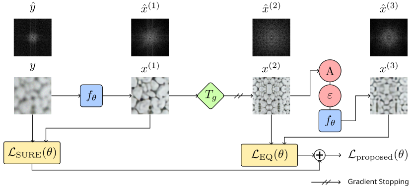

# Self-Supervised Learning for Image Super-Resolution and Deblurring (CVPR 2024 submission)

The implementation of ["Self-Supervised Learning for Image Super-Resolution and Deblurring"](https://arxiv.org/abs/2312.11232) by [Jérémy Scanvic](https://github.com/jscanvic), [Mike Davies](https://www.research.ed.ac.uk/en/persons/michael-davies), [Patrice Abry](http://perso.ens-lyon.fr/patrice.abry/index.html), and [Julián Tachella](https://tachella.github.io/)



## Results

Sample reconstructions for Gaussian deblurring with different standard deviations, using the proposed self-supervised method, a supervised method, and another self-supervised method (CSS)


## Getting Started

1. Clone the repository
```sh
git clone https://github.com/jscanvic/Scale-Equivariant-Imaging
cd Scale-Equivariant-Imaging
```
2. Install the requirements
```sh
pip install -r requirements.txt
```

## Training a model

You can train a model using one of the methods used in the paper, i.e. the proposed, supervised, and CSS methods, and equivariant imaging methods using shifts and rotations. The resulting weights are written to disk and can be tested as explained in the testing section. Additionally, the training state (i.e. model weights, optimizer state, etc.) is saved at different epochs to allow for resuming training. A sample usage of the training script is written below, along with an explanation of each flag.

```sh
python demo/train.py --device cuda:0 \
 --method proposed --stop_gradient \
 --task deblurring \
 --kernel kernels/Gaussian_R2.pt \
 --noise_level 5 --out_dir ./results \
 --download
```

| Flag              | Explanation                                                               |
|-------------------|---------------------------------------------------------------------------|
| `--method`        | Training method, i.e. `proposed`, `sup`, `css`, `ei-shift` or `ei-rotate` |
| `--stop_gradient` | Stop the gradient for proposed and equivariant imaging methods (optional) |
| `--task`          | Task, i.e. `deblurring` or `sr`                                           |
| `--sr_factor`     | Super-resolution factor, i.e. `2` or `4` (optional)                       |
| `--kernel`        | Path to the blurring kernel (optional)                                    |
| `--noise_level`   | Noise level, e.g. `5`                                                     |
| `--out_dir`       | Directory where weights and checkpoints should be written                 |
| `--device`        | PyTorch device, e.g. `cpu` (default) or `cuda:0`                          |
| `--download`      | Download the dataset                                                      |

## Testing a model

You can test a model with precomputed weights used in the paper, which we made available on [Hugging Face 🤗](https://huggingface.co/jscanvic/scale-equivariant-imaging/tree/main), or with weights you obtained by training a model. The resulting PSNR and SSIM are written to the standard output. A sample usage of the testing script is written below, along with an explanation of each flag.

```sh
python demo/test.py --device cuda:0 --task deblurring \
 --kernel kernels/Gaussian_R2.pt --noise_level 5 \
 --split val --weights Deblurring_Gaussian_R2_Noise5_Proposed \
 --download
```

| Flag            | Explanation                                                                                                                                                                                   |
|-----------------|-----------------------------------------------------------------------------------------------------------------------------------------------------------------------------------------------|
| `--task`        | Task, i.e. `deblurring` or `sr`                                                                                                                                                               |
| `--sr_factor`   | Super-resolution factor, i.e. `2` or `4` (optional)                                                                                                                                           |
| `--kernel`      | Path to the blurring kernel (optional)                                                                                                                                                        |
| `--noise_level` | Noise level, e.g. `5`                                                                                                                                                                         |
| `--weights`     | Path to the weights or name of a pretrained model, e.g. `Deblurring_Gaussian_R2_Noise5_Proposed` (See [Hugging Face 🤗](https://huggingface.co/jscanvic/scale-equivariant-imaging/tree/main)) |
| `--split`       | Dataset split, i.e. `train` or `val`                                                                                                                                                          |
| `--device`      | PyTorch device, e.g. `cpu` (default) or `cuda:0`                                                                                                                                              |
| `--download`    | Download the dataset                                                                                                                                                                          |

## Citation

```bibtex
@misc{scanvic2023selfsupervised,
	title={Self-Supervised Learning for Image Super-Resolution and Deblurring},
	author={Jérémy Scanvic and Mike Davies and Patrice Abry and Julián Tachella},
	year={2023},
	eprint={2312.11232},
	archivePrefix={arXiv},
	primaryClass={eess.IV}
}
```
